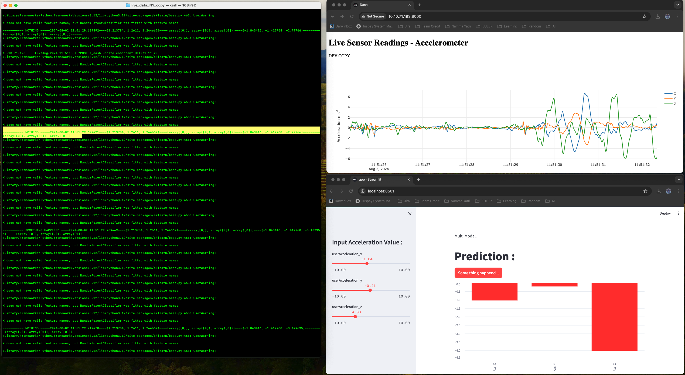
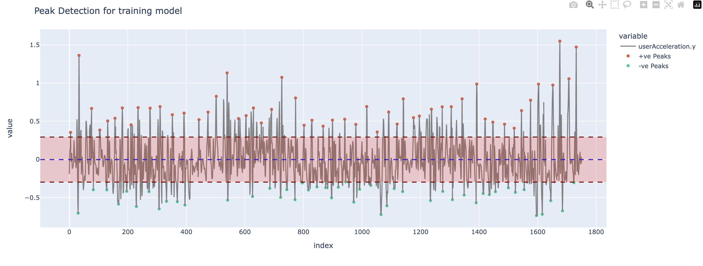
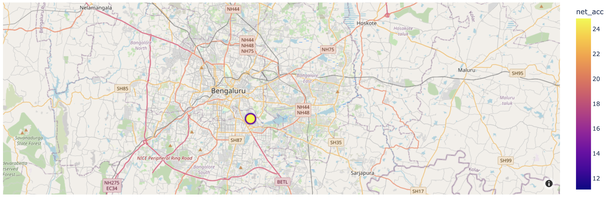
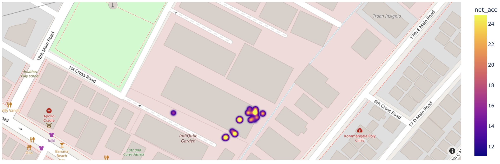
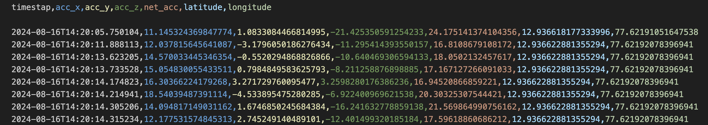

# Road-Rider-Vehicle Analytics 🚦

The code allows to generate Road, Rider and Vehicle Analytics just by using the sensors of your Smart Phone.

- **Road Analytics** : The custom model(Random Forest Classifier) built allows to identify road potholes, and speed bumps. Using the classfied data we generate results and insights.
- **Rider Analytics** : The rider analytics can be drawn from data stream that we receive from smart phone, giving us information on riders braking, acceleration and more.
- **Vehicle Analytics** : The wear and tear of vehicle can also be predicted based on the accleration data and more.

```
Heatmaps can be also generated using Model predicted data and other parameters.
```

The code consumes following sensor data :
- **Accelerometer**
- **Location (lat., lang.)**

> NOTE : The repo has various versions of code, each with different implication.

 The repo also contains model trained on small dataset. The models in repo are :
- Random Forest Classifier
- RNN - LSTM

> Real Recorded data can be also found in repo.

Data points predicted by models are also saved in ```.csv``` files for future derivations.

## Demo Images

Data Studying and understanding thresholds based on different road condition.



Heatmaps based on model output and intensity of acceleration.



Saved model output with various parameters.

